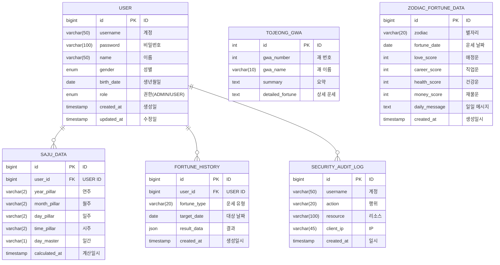

```mermaid
erDiagram
    USER {
        bigint id PK "ID"
        varchar(50) username "계정"
        varchar(100) password "비밀번호"
        varchar(50) name "이름"
        enum gender "성별"
        date birth_date "생년월일"
        enum role "권한(ADMIN/USER)"
        timestamp created_at "생성일"
        timestamp updated_at "수정일"
    }
    SECURITY_AUDIT_LOG {
        bigint id PK "ID"
        varchar(50) username "계정"
        varchar(20) action "행위"
        varchar(100) resource "리소스"
        varchar(45) client_ip "IP"
        timestamp created_at "일시"
    }
    TOJEONG_GWA {
        int id PK "ID"
        int gwa_number "괘 번호"
        varchar(10) gwa_name "괘 이름"
        text summary "요약"
        text detailed_fortune "상세 운세"
    }
    SAJU_DATA {
        bigint id PK "ID"
        bigint user_id FK "USER ID"
        varchar(2) year_pillar "연주"
        varchar(2) month_pillar "월주"
        varchar(2) day_pillar "일주"
        varchar(2) time_pillar "시주"
        varchar(1) day_master "일간"
        timestamp calculated_at "계산일시"
    }
    FORTUNE_HISTORY {
        bigint id PK "ID"
        bigint user_id FK "USER ID"
        varchar(20) fortune_type "운세 유형"
        date target_date "대상 날짜"
        json result_data "결과"
        timestamp created_at "생성일시"
    }
    ZODIAC_FORTUNE_DATA {
        bigint id PK "ID"
        varchar(20) zodiac "별자리"
        date fortune_date "운세 날짜"
        int love_score "애정운"
        int career_score "직업운"
        int health_score "건강운"
        int money_score "재물운"
        text daily_message "일일 메시지"
        timestamp created_at "생성일시"
    }
    USER ||--o{ SAJU_DATA : ""
    USER ||--o{ FORTUNE_HISTORY : ""
    USER ||--o{ SECURITY_AUDIT_LOG : ""
```