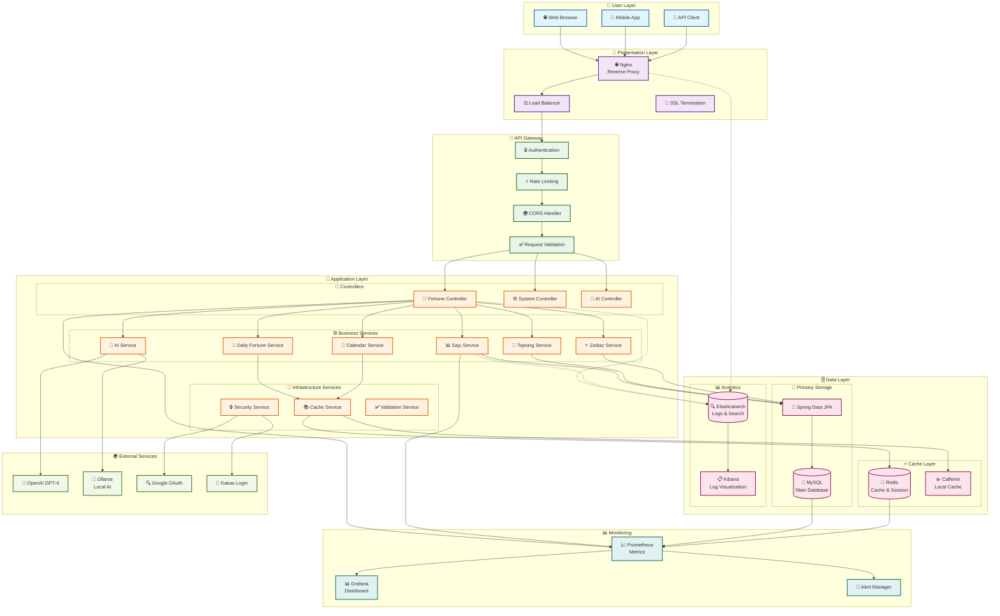

```mermaid
graph TB
    %% 사용자 계층
    subgraph "👥 User Layer"
        Web[🌐 Web Browser]
        Mobile[📱 Mobile App]
        API[🔧 API Client]
    end

    %% 프레젠테이션 계층
    subgraph "🎨 Presentation Layer"
        Nginx[🌐 Nginx<br/>Reverse Proxy]
        LB[⚖️ Load Balancer]
        SSL[🔐 SSL Termination]
    end

    %% API 게이트웨이
    subgraph "🚪 API Gateway"
        Auth[🔒 Authentication]
        Rate[⚡ Rate Limiting]
        CORS[🌍 CORS Handler]
        Validation[✅ Request Validation]
    end

    %% 애플리케이션 계층
    subgraph "🚀 Application Layer"
        subgraph "🎯 Controllers"
            FC[🔮 Fortune Controller]
            SC[⚙️ System Controller]
            AC[🤖 AI Controller]
        end
        
        subgraph "⚙️ Business Services"
            SajuSvc[📊 Saju Service]
            TojeongSvc[📜 Tojeong Service]
            ZodiacSvc[⭐ Zodiac Service]
            DailySvc[📅 Daily Fortune Service]
            CalendarSvc[📆 Calendar Service]
            AISvc[🤖 AI Service]
        end
        
        subgraph "🔧 Infrastructure Services"
            CacheSvc[📚 Cache Service]
            SecuritySvc[🔒 Security Service]
            ValidSvc[✅ Validation Service]
        end
    end

    %% 데이터 계층
    subgraph "🗄️ Data Layer"
        subgraph "💾 Primary Storage"
            MySQL[(🐬 MySQL<br/>Main Database)]
            JPA[🔗 Spring Data JPA]
        end
        
        subgraph "⚡ Cache Layer"
            Redis[(🔴 Redis<br/>Cache & Session)]
            Caffeine[☕ Caffeine<br/>Local Cache]
        end
        
        subgraph "📊 Analytics"
            ES[(🔍 Elasticsearch<br/>Logs & Search)]
            Kibana[📋 Kibana<br/>Log Visualization]
        end
    end

    %% 외부 서비스
    subgraph "🌍 External Services"
        OpenAI[🤖 OpenAI GPT-4]
        Ollama[🦙 Ollama<br/>Local AI]
        Google[🔍 Google OAuth]
        Kakao[💬 Kakao Login]
    end

    %% 모니터링
    subgraph "📊 Monitoring"
        Prometheus[📈 Prometheus<br/>Metrics]
        Grafana[📊 Grafana<br/>Dashboard]
        Alerting[🚨 Alert Manager]
    end

    %% 연결 관계
    Web --> Nginx
    Mobile --> Nginx
    API --> Nginx
    
    Nginx --> LB
    LB --> Auth
    Auth --> Rate
    Rate --> CORS
    CORS --> Validation
    
    Validation --> FC
    Validation --> SC
    Validation --> AC
    
    FC --> SajuSvc
    FC --> TojeongSvc
    FC --> ZodiacSvc
    FC --> DailySvc
    FC --> CalendarSvc
    FC --> AISvc
    
    SajuSvc --> JPA
    TojeongSvc --> JPA
    ZodiacSvc --> JPA
    DailySvc --> CacheSvc
    CalendarSvc --> CacheSvc
    AISvc --> OpenAI
    AISvc --> Ollama
    
    CacheSvc --> Redis
    CacheSvc --> Caffeine
    
    JPA --> MySQL
    
    SecuritySvc --> Google
    SecuritySvc --> Kakao
    
    %% 모니터링 연결
    FC --> Prometheus
    SajuSvc --> Prometheus
    MySQL --> Prometheus
    Redis --> Prometheus
    
    Prometheus --> Grafana
    Prometheus --> Alerting
    
    %% 로깅
    FC -.-> ES
    SajuSvc -.-> ES
    Nginx -.-> ES
    ES --> Kibana

    %% 스타일링
    classDef userClass fill:#e1f5fe,stroke:#01579b,stroke-width:2px
    classDef presentationClass fill:#f3e5f5,stroke:#4a148c,stroke-width:2px
    classDef gatewayClass fill:#e8f5e8,stroke:#1b5e20,stroke-width:2px
    classDef appClass fill:#fff3e0,stroke:#e65100,stroke-width:2px
    classDef dataClass fill:#fce4ec,stroke:#880e4f,stroke-width:2px
    classDef externalClass fill:#f1f8e9,stroke:#33691e,stroke-width:2px
    classDef monitoringClass fill:#e0f2f1,stroke:#00695c,stroke-width:2px

    class Web,Mobile,API userClass
    class Nginx,LB,SSL presentationClass
    class Auth,Rate,CORS,Validation gatewayClass
    class FC,SC,AC,SajuSvc,TojeongSvc,ZodiacSvc,DailySvc,CalendarSvc,AISvc,CacheSvc,SecuritySvc,ValidSvc appClass
    class MySQL,JPA,Redis,Caffeine,ES,Kibana dataClass
    class OpenAI,Ollama,Google,Kakao externalClass
    class Prometheus,Grafana,Alerting monitoringClass
```
