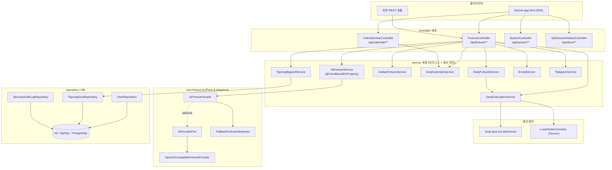
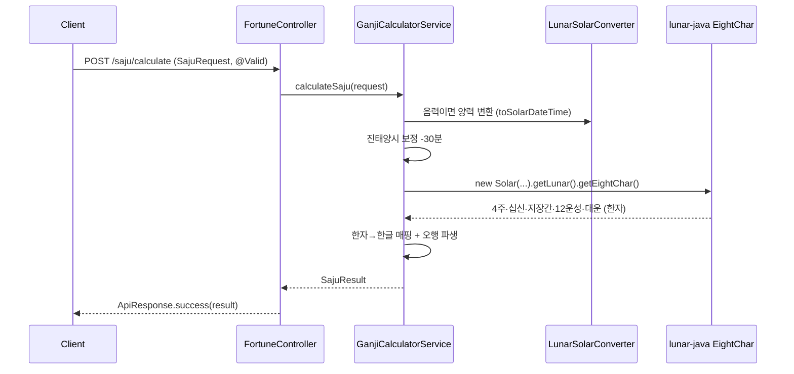
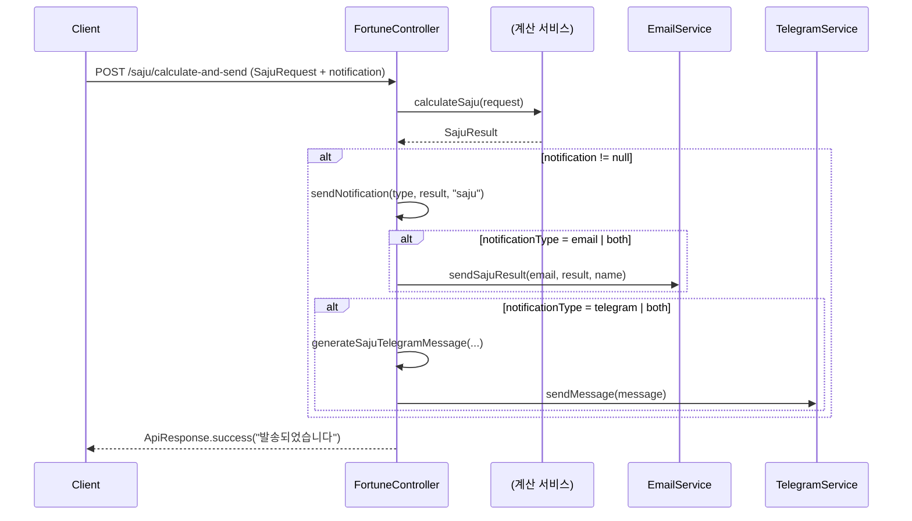
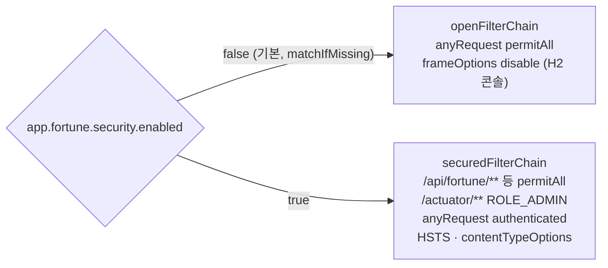

# 02. 아키텍처

> 레이어 구조, 요청 흐름(사주 계산 및 계산+발송 파사드), 컴포넌트 배치, 캐시·관측성·보안 배선을 실제 코드 기준으로 정리합니다.
> 관련: [프로젝트 개요](01-project-overview.md) · [데이터 모델](04-data-model.md) · [API 레퍼런스](05-api-reference.md) · [AI와 폴백](06-ai-and-fallback.md)

---

## 2.1 레이어 구조

전형적인 `controller → service → (ai | repository)` 계층입니다. AI는 별도 Ports&Adapters 하위 계층으로 격리됩니다.

- **controller**: 얇은 HTTP 어댑터. 입력 검증(`@Valid`)과 `ApiResponse<T>` 래핑, try/catch 후 에러 코드 반환만 담당 (`FortuneController.java:71-86`).
- **service**: 순수 계산 로직 + 발송. 계산 엔진(`GanjiCalculatorService`)이 절기/음양력 보조 클래스를 사용.
- **ai**: `AIFortuneService`(레거시 호환 어댑터)가 `AiFortuneFacade` 를 호출하고, Facade가 외부 Provider 또는 로컬 Fallback으로 분기 ([06 문서](06-ai-and-fallback.md)).
- **repository**: JPA. 운세 계산 자체는 무상태이며 DB는 사용자·감사로그·토정괘 마스터에 쓰입니다 ([04 문서](04-data-model.md)).

메인 클래스 `KoreanFortuneApplication` 은 `@SpringBootApplication @EnableCaching @EnableAsync @EnableScheduling @EnableTransactionManagement @ConfigurationPropertiesScan` 를 켭니다 (`KoreanFortuneApplication.java:46-51`).

## 2.2 요청 흐름 ① 사주 계산

`POST /api/fortune/saju/calculate` → `FortuneController.calculateSaju` → `GanjiCalculatorService.calculateSaju` (`FortuneController.java:71-86`).

계산 단계는 `GanjiCalculatorService.java:58-120` 에 번호 주석(1~9)으로 명시되어 있습니다: (1) 입력 구성+음양력 변환 → (2) 진태양시 -30분 보정 → (3) 입춘 기준 연주 → (4) 절기 월지 + 오호둔 월간 → (5) 율리우스일 60갑자 일주 → (6) 오서둔 시주 → (7) 명리 상세 파생 → (8) 대운 → (9) 오행 분석. 상세 알고리즘은 [03. 계산 방법론](03-saju-calculation-methodology.md).

## 2.3 요청 흐름 ② 계산 + 발송 파사드

`*/calculate-and-send` 엔드포인트는 계산 후 `SajuRequest.notification`(선택) 유무에 따라 알림을 발송합니다. 컨트롤러 내부 private 메서드 `sendNotification` 이 파사드 역할을 합니다 (`FortuneController.java:383-406, 538-623`).

- `notificationType` 은 `email` / `telegram` / `both` 중 하나이며 `NotificationRequest` 에서 정규식으로 검증됩니다 (`NotificationRequest.java:33-35`).
- 발송 타입 분기(`saju`/`daily`/`tojeong`/`zodiac`)에 따라 이메일 메서드와 텔레그램 메시지 생성기가 선택됩니다 (`FortuneController.java:580-623`).
- 동일 패턴이 `daily/today-and-send`, `tojeong/calculate-and-send`, `zodiac/calculate-and-send` 에 반복됩니다.

## 2.4 캐시 배선

Caffeine 기반이며 캐시 이름별로 TTL·최대 크기를 독립 설정합니다. `@EnableCaching` 은 메인 클래스, per-cache 정의는 `CacheConfig.cacheManager()` (`CacheConfig.java:43-60`).

| 캐시 이름 | TTL(초) | 최대 크기 | 용도 |
|-----------|---------|-----------|------|
| `users` | 1800 | 500 | 사용자 정보 |
| `daily-fortune` | 3600 | 1000 | 일일 운세 |
| `year-pillar` | 86400 | 200 | 연주 계산 |
| `day-pillar` | 86400 | 500 | 일주 계산 |
| `blacklist` | 3600 | 10000 | JWT 블랙리스트 |
| `ai-saju-interpretation` | 86400 | 100 | AI 사주 해석 |
| `ai-daily-advice` | 86400 | 100 | AI 일일 조언 |
| `ai-zodiac-advice` | 86400 | 100 | AI 별자리 조언 |
| `ai-tojeong-advice` | 86400 | 100 | AI 토정 조언 |
| `fortune-data` | 3600 | 500 | 운세 데이터 |
| `zodiac-fortune` | 3600 | 300 | 별자리 운세 |

AI 응답은 `AIFortuneService` 의 `@Cacheable` 로 캐시됩니다(예: 키 `#sajuResult.dayMaster + '_' + #sajuResult.dayPillar`, `AIFortuneService.java:27`). `recordStats()` 활성화로 `/actuator/caches` 노출됩니다 (`CacheConfig.java:75`, `application.yml:86`).

## 2.5 관측성 배선

- **메트릭**: `micrometer-registry-prometheus` → `/actuator/prometheus`. 노출 엔드포인트는 `health,info,metrics,prometheus,caches` (`application.yml:83-86`).
- **트레이싱**: `micrometer-tracing-bridge-otel`. 개발은 100% 샘플링(`tracing.sampling.probability: 1.0`), OTLP 트레이싱 엔드포인트는 `OTEL_EXPORTER_OTLP_ENDPOINT` 있을 때만 활성 (`application.yml:93-103`). 운영은 OTLP export 켜짐 (`application-prod.yml:76`).
- **로그 MDC**: 콘솔·파일 로그 패턴에 `trace=%X{traceId:-} span=%X{spanId:-}` 를 포함해 traceId/spanId 를 상관합니다 (`application.yml:76-77`).
- **헬스**: 커스텀 `FortuneHealthIndicator` 가 `/actuator/health` 세부 상태(`show-details: always`)에 기여 (`application.yml:87-89`).

## 2.6 보안 배선

`SecurityConfig` 는 `app.fortune.security.enabled` 토글로 두 개의 `SecurityFilterChain` 중 하나를 조건부 등록합니다 (`SecurityConfig.java:34-81`).

- 공통: CSRF 비활성, CORS 소스는 `localhost`/`127.0.0.1` 임의 포트 허용, `PasswordEncoder` 는 BCrypt (`SecurityConfig.java:88-121`).
- JWT 인증 요소(`JwtAuthenticationFilter`, `JwtTokenUtil`, `JwtAuthenticationEntryPoint`, `JwtAccessDeniedHandler`)는 `com.fortune.security` 에 존재하며 보안 활성 프로필에서 쓰입니다.
- 기본(dev) 프로필은 보안 off — 모든 API가 열려 있고 H2 콘솔 프레임 허용. 운영(`prod`)은 `security.enabled=true` (`application-prod.yml:49`).

## 2.7 예외 처리

`GlobalExceptionHandler`(`@RestControllerAdvice`)가 검증 실패·JSON 파싱 오류·미지원 메서드·리소스 없음·일반 예외를 잡아 일관된 `ApiResponse.error(message, errorCode)` 로 변환합니다 (`GlobalExceptionHandler.java:36-99`). 다만 각 컨트롤러 메서드도 자체 try/catch 로 도메인별 에러 코드(`SAJU_CALC_ERROR` 등)를 우선 반환합니다 ([05 문서](05-api-reference.md) 참조).
