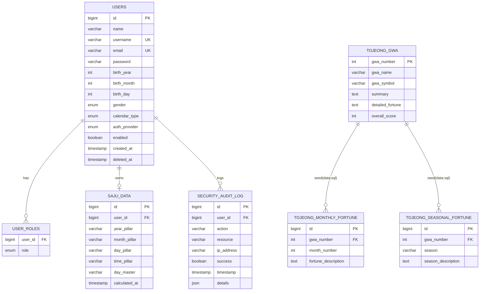

# 04. 데이터 모델

> JPA 엔티티, 주요 DTO(SajuResult 의 Pillar/DaeUn 포함), DB 스키마, ERD 를 실제 코드/SQL 기준으로 정리합니다.
> 관련: [아키텍처](02-architecture.md) · [API 레퍼런스](05-api-reference.md) · 기존 다이어그램 [../ERD.md](../ERD.md)

---

## 4.1 개요

운세 계산(사주/일일/토정/별자리)은 대부분 **무상태 계산**이며 요청 결과를 DTO로 반환합니다. 영속 엔티티는 4종으로, 사용자·감사로그·토정괘 마스터 데이터에 국한됩니다. 개발/테스트는 H2 인메모리(`create-drop`), 운영은 MySQL(`validate`)이며 PostgreSQL 드라이버도 포함됩니다 (`application.yml:12-23`, `application-prod.yml:9-22`, `build.gradle:49-51`).

## 4.2 JPA 엔티티

### 4.2.1 `User` (`entity/User.java`)

`@Table(name = "users")`, 5개 인덱스 정의 (`User.java:29-35`). 로컬 회원 + OAuth2 소셜 로그인 사용자를 함께 표현합니다.

| 필드 | 컬럼 | 타입/제약 | 비고 |
|------|------|-----------|------|
| `id` | id | PK, IDENTITY | |
| `name` | name | not null, 50 | |
| `username` | username | unique, 100 | |
| `email` | email | not null, unique, 100 | |
| `password` | password | 255 | BCrypt 저장 |
| `birthYear/Month/Day/Hour/Minute` | birth_* | Integer | 사주 입력 |
| `gender` | gender | enum `M/F` | |
| `calendarType` | calendar_type | enum `SOLAR/LUNAR` | |
| `birthLocation` | birth_location | 100 | 태양시 보정용 |
| `authProvider` | auth_provider | enum, 기본 `LOCAL` | LOCAL/GOOGLE/KAKAO/NAVER/FACEBOOK |
| `providerId` | provider_id | 100 | |
| `roles` | (user_roles 조인) | `@ElementCollection` EAGER | USER/ADMIN/MODERATOR/PREMIUM |
| `enabled`/`accountLocked`/`emailVerified` | | Boolean | 계정 상태 |
| `loginCount`/`failedLoginAttempts` | | Integer | 5회 실패 시 잠금 (`User.java:342-347`) |
| `preferredLanguage`/`timezone`/`aiFeaturesEnabled`/`notificationEnabled`/`marketingEmailsEnabled` | | | 사용자 설정 |
| `createdAt`/`updatedAt` | created_at/updated_at | `@CreationTimestamp`/`@UpdateTimestamp` | |
| `deletedAt` | deleted_at | | 소프트 삭제 (`softDelete()`) |

내부 enum: `Role`, `Gender`, `CalendarType`, `AuthProvider`, `Language` (`User.java:142-291`). 비즈니스 메서드: `hasBirthDateInfo`, `isAccountActive`, `incrementFailedLoginAttempts`, `handleSuccessfulLogin`, `updateOAuth2Info` 등.

### 4.2.2 `SajuData` (`entity/SajuData.java`)

계산된 4주를 사용자에 1:1로 저장. `@Table(name = "saju_data")`, `user_id`/`calculated_at` 인덱스 (`SajuData.java:17-20`).

| 필드 | 컬럼 | 제약 |
|------|------|------|
| `id` | id | PK |
| `user` | user_id | `@OneToOne(LAZY)`, not null |
| `yearPillar`/`monthPillar`/`dayPillar` | *_pillar | length 2, not null |
| `timePillar` | time_pillar | length 2 (nullable) |
| `dayMaster` | day_master | length 1, not null |
| `calculatedAt` | calculated_at | not null, `@PrePersist` 기본 now |

### 4.2.3 `SecurityAuditLog` (`entity/SecurityAuditLog.java`)

보안 이벤트 기록. `@Table(name = "security_audit_log")`.

| 필드 | 컬럼 | 제약 |
|------|------|------|
| `id` | id | PK |
| `user` | user_id | `@ManyToOne(LAZY)` |
| `action` | action | not null, 100 |
| `resource` | resource | 100 |
| `ipAddress` | ip_address | 45 |
| `userAgent` | user_agent | TEXT |
| `success` | success | not null, `@PrePersist` 기본 false |
| `timestamp` | timestamp | not null, `@PrePersist` 기본 now |
| `details` | details | JSON |

조회는 `SecurityAuditLogRepository` 의 count/집계 쿼리(실패 로그인 IP TOP N, 사용자별 최근 로그 등, `SecurityAuditLogRepository.java:76-94`)로 수행합니다.

### 4.2.4 `TojeongGwaEntity` (`entity/TojeongGwaEntity.java`)

토정비결 64괘 마스터 테이블. `@Table(name = "tojeong_gwa")`.

> ⚠️ **레거시**: 현재 `TojeongBigyeolService`는 144괘(상8×중6×하3) 산식을 **코드 내에서 결정론적으로 계산**하며(DTO `com.fortune.dto.TojeongGwa`), 이 엔티티·`TojeongGwaRepository`·`data.sql`의 64괘 시드는 런타임 계산에 **사용되지 않는다**. 스키마·시드는 과거 구현의 잔재다.

| 필드 | 컬럼 | 제약 |
|------|------|------|
| `id` | id | PK |
| `gwaNumber` | gwa_number | unique, not null |
| `gwaName` | gwa_name | not null, 10 |
| `gwaSymbol` | gwa_symbol | not null, 5 |
| `summary` | summary | not null |
| `detailedFortune` | detailed_fortune | not null, TEXT |
| `overallScore` | overall_score | not null, 기본 50 |

`TojeongGwaRepository` 는 `findByGwaNumber`, 점수 범위 조회를 제공합니다 (`TojeongGwaRepository.java:24-39`).

## 4.3 주요 DTO

계산 결과는 엔티티가 아닌 DTO로 반환됩니다. 응답 필드 요약은 [05. API 레퍼런스](05-api-reference.md) 참조. 여기서는 `SajuResult` 의 명리 상세 구조를 집중 설명합니다.

### 4.3.1 `SajuResult` (`dto/SajuResult.java`)

기본 4주 문자열(`yearPillar`~`timePillar`, `dayMaster`)과 `WuxingAnalysis`(오행 개수·최강/최약), `adjustedDateTime`(진태양시 보정 결과)에 더해, **명리 상세 신규 필드**가 추가되었습니다 (`SajuResult.java:35-46`).

| 신규 필드 | 타입 | 설명 |
|-----------|------|------|
| `yearDetail`/`monthDetail`/`dayDetail`/`timeDetail` | `Pillar` | 각 주의 천간/지지·십신·지장간·12운성 |
| `daeun` | `List<DaeUn>` | 대운 목록(각 10년) |
| `daeunForward` | boolean | 대운 방향(true=순행 양남음녀) |
| `daeunNumber` | int | 대운수(시작 나이) |

`Pillar`(내부 static 클래스, `SajuResult.java:86-100`):

| 필드 | 설명 |
|------|------|
| `stem`/`branch` | 천간/지지 (한글) |
| `stemHanja`/`branchHanja` | 한자 |
| `stemSipsin` | 천간 십신(일간은 "일간(본원)") |
| `branchSipsin` | 지지 본기(정기) 십신 |
| `twelveStage` | 일간 대비 지지의 12운성 |
| `hiddenStems` | 지장간 목록 |
| `hiddenStemsSipsin` | 지장간별 십신 |

`DaeUn`(`SajuResult.java:105-116`): `age`(시작 나이), `ganji`/`ganjiHanja`, `stemSipsin`, `branchSipsin`, `twelveStage`.

`getFormattedSaju()` 는 4주를 공백 구분 문자열로 반환합니다 (`SajuResult.java:57-59`).

### 4.3.2 기타 결과 DTO

- `DailyFortuneResult`: `date`, `dayPillar`, `totalScore`, `categoryFortune`(연애/직업/건강/재물), `sinsals`, `advice`, `luckyDirection`, `luckyColors`, `caution` (`DailyFortuneResult.java:19-29`).
- `TojeongResult`: `targetYear`, `gwaNumber/Name/Symbol`, `summary`, `detailedFortune`, `overallScore`, `advice`, `luckyMonths`, `cautionMonths`, `monthlyFortune` (`TojeongResult.java:17-29`).
- `ZodiacFortuneResult`: `zodiac`(enum), `zodiacKoreanName`, `todayFortune`, `monthlyFortune`, `compatibleZodiacs`, `luckyNumbers/Color/Stone`, `personality` (`ZodiacFortuneResult.java:19-30`).
- `GanjiCalendarResponse`: `year`, `month`, `days`, `solarTerms`, `monthlyTheme/Advice`, `luckyDays`, `cautionDays` (`GanjiCalendarResponse.java:20-31`).
- `ApiResponse<T>`: 모든 응답 래퍼 — `success`, `data`, `message`, `errorCode`, `timestamp` (`ApiResponse.java:22-71`).

## 4.4 DB 스키마 (SQL 소스)

두 종류의 SQL이 존재합니다.

| 파일 | 대상 | 내용 |
|------|------|------|
| `database/schema.sql` | MySQL 운영 | `users`, `user_roles`, `saju_data`, `security_audit_log`, `sinsal_master`, `tojeong_gwa`, 운세 캐시 테이블 (`schema.sql:8-120`) |
| `database/init.sql` | MySQL 초기화 | DB/계정 생성 + 간이 `users`/`saju_data`/`fortune_history` (스키마가 `schema.sql`과 다른 축소판) |
| `database/data.sql` | MySQL | 신살 마스터 + 토정괘 3개 샘플 |
| `src/main/resources/data.sql` | H2/JPA 초기 로드 | `tojeong_gwa` 및 월별·계절별·사용자 기록 테이블 생성 + **토정 64괘 전체 MERGE** (`data.sql:1-187`) |
| `src/main/resources/indexes.sql` | 운영 인덱스 | 토정 관련 인덱스 (별도 실행) |

주의사항:
- 엔티티(`User`/`SajuData` 등)의 실제 컬럼은 JPA `ddl-auto` 로 생성되며, `database/*.sql` 은 MySQL 운영 참고용입니다. `database/init.sql` 의 `saju_data` 는 엔티티와 컬럼 구성이 다른 옛 버전이므로 실제 스키마 기준은 엔티티 + `database/schema.sql` 입니다.
- `src/main/resources/data.sql` 은 H2에서 토정 64괘 데이터를 채우는 실질 시드입니다(`MERGE INTO tojeong_gwa`). `overall_score` 구간별로 상상괘~하괘가 분류됩니다.

## 4.5 ERD

실제 엔티티(`User`, `SajuData`, `SecurityAuditLog`, `TojeongGwaEntity`) + `user_roles` 조인 + 토정 시드 테이블 기준입니다. (기존 [../ERD.md](../ERD.md) 는 `FORTUNE_HISTORY`/`ZODIAC_FORTUNE_DATA` 등 코드에 매핑 엔티티가 없는 개념 테이블까지 포함한 개념도이므로, 아래는 코드에 존재하는 것으로 좁힌 버전입니다.)

